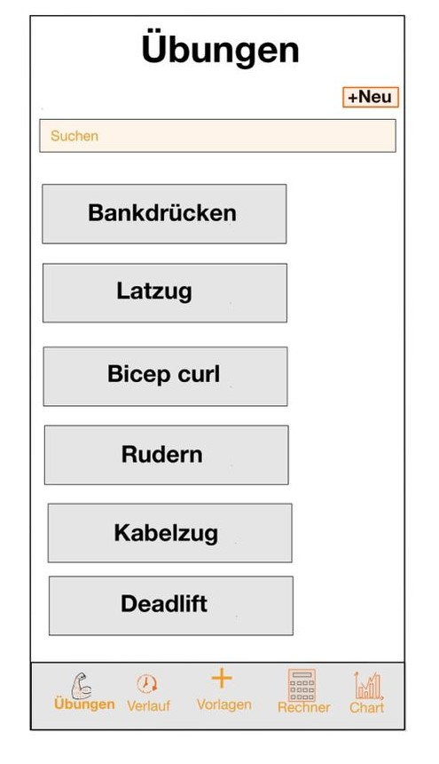
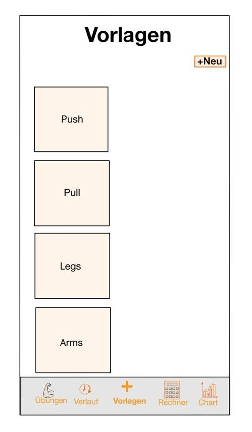
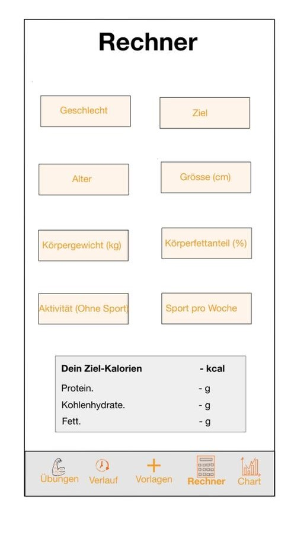

= image:GUI/logo.jpg[100,90] Stayfit

== Beschreibung
Das Ziel dieses Projekts ist es, eine benutzerfreundliche App zu erstellen,
mit der Nutzer ihre Trainingspläne, ihr Gewicht und ihre Fitnessfortschritte verfolgen können. +
Mit dieser App können Sie Ihre Workouts planen, Ihre Fortschritte
nachverfolgen und Ihre Leistung im Laufe der Zeit verbessern. +
Sie können Ihre  Trainingsziele festlegen und sehen, wie Sie sich von Training zu Training verbessern. +
Darüber hinaus können Sie die Anzahl der Sätze und Wiederholungen aufzeichnen,
um sicherzustellen, dass Sie Ihre Ziele erreichen und Ihre Fitness verbessern. +
Mit dieser App haben Sie alle wichtigen Informationen über Ihr Training jederzeit griffbereit und
können Ihre Fortschritte in Echtzeit verfolgen.

== Datenmodell

[plantuml]
----
include::./plantuml/cld.puml[]
----

== Prototyp

* GUI App-Punkte

.Übungen
[%collapsible]
====

====

.Vorlagen
[%collapsible]
====

====

.Kalorien Rechner
[%collapsible]
====

====
